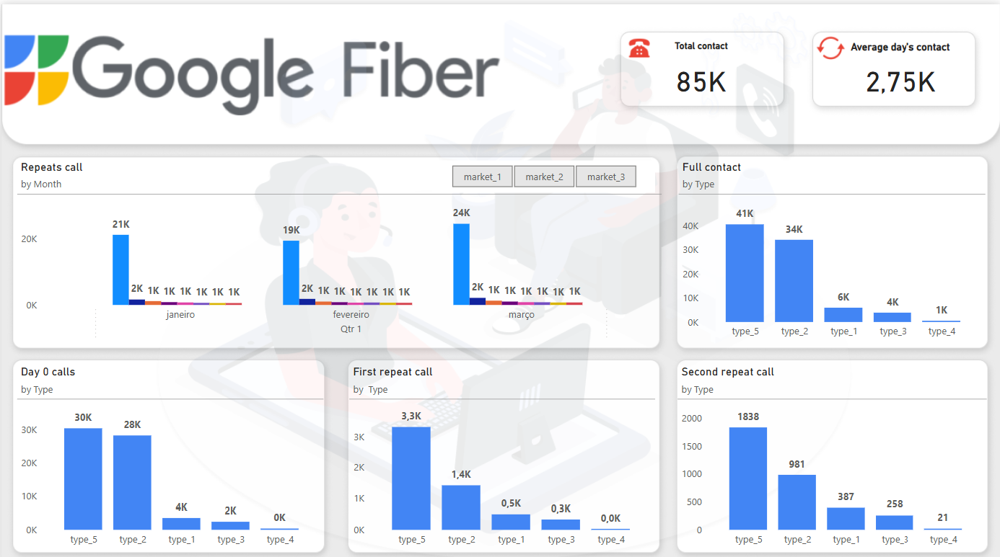

# fiber_project_BI
 
# Projeto Business Intelligence - Fiber

Este projeto foi elaborado durante o processo de certificação do Google Business Intelligence Certificate e tem como objetivo principal desenvolver uma **ferramenta de Business Intelligente**, que suporte a tomada de decisão dos times de negócios, passando pelas etapas: planejamento do projeto, preparação dos dados e criação do dashboard.

## Resultados e insights:
Abaixo listei os principais resultados e insights gerados ao time de atendimento, focado em melhorar o operacional de atendimento ao cliente.

## Fiber project - Atendimento

💡 O número médio de chamadas diarias está em 2,75k, totalizando 85k chamadas no primeiro trimestre do ano.
 
💡 As chamadas se repetem até 7 vezes para tratativa do mesmo assunto e se dividem em 5 principais tipos.
Desta forma esses são os melhores pontos para:
 
💡 O tipo 5 (internet e wifi) representa 48% dos motivos das chamadas e se estende até 3 contatos para resolução total. Assim sendo o primeiro tipo que deve receber tratativa para resolução, seguido do tipo 2 (problemas técnicos), que representa 40% das chamadas.
- A tratativa dos dois tipos reduzem 75k de chamadas e rechamadas ao atendimento - otimizando 88% do total.
 
💡 O números de chamadas não apresentam alterações significaticas que possam atrelar a sazonalidade ao longo do primeiro trimestre, porém não se pode afirmar o mesmo padrão ao longo do ano, uma vez que a amostra analisada não contém informações referente aos demais trimestres.
-----
 

### Processo de desenvolvimento do projeto:
**Contexto:** A Google Fiber é uma empresa que prove serviço de internet, e o time de Serviço ao Cliente precisa otimizar o processo operacional e melhorar a satisfação do cliente. E para isso precisão entender quanto as ligações se repetem e quais são os motivos são mais reincidentes.  

Obs.: A Google Fiber e todos os dados compartilhados são fictícios 😉

**Objetivo:** Criar uma solução de BI que ofereça insights estratégicos para os times de atendimento, analisando os dados de contatos das três principais cidades mercantis.

## 1. Dados, Ferramentas e o Pipeline
Os dados utilizadas no desenvolvimento do projeto são cópias dos datasets independentes dos 3 principais cidades mercantis, que foram unificados durante o processo de ETL. 

**Construção do pipeline**
As informações são extraídas, tratadas (limpeza de nulos e filtro do período específico) e gravadas nas tabelas processadas no BigQuery (target_table_contact). O pipeline final do projeto com todas as ferramentas:

>**Ferramentas:** 
>- BigQuery 
>- DataFlow
>- Python
>- Power BI

## 3. Dashboard
As tabelas tratados foram integradas com o Looker Studio para a criação do dashboard, que permite a visualização clara e iterativa dos indicadores estabelecidos no planejamento. O dashbaord foi subdividido em 4 visualizações, para facilitar a interpretação dos dados.
- Totais por mês, tipo, contato 0, contato 1 e contato 2.

**Filtros Dinâmicos:** Inclui diversos filtros em todas as visualizações, para que os dados possam ser segmentados.

-----
 
Este projeto demonstra a aplicação prática de conceitos fundamentais de BI, passando por todas as etapas de desenvolvimento, e todos os arquivos utilizados no desenvolvimento estão disponiveis para consulta neste repositório. Caso tenha sugestões e/ou comentários, fique à vontade para contribuir! 😊